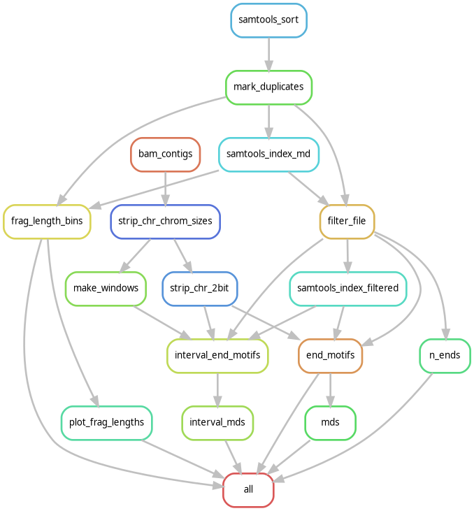

# cfdna-finale-snakemake

End-motif analysis pipeline for Snyder 2016 cfDNA BAMs, built on
[FinaleToolkit](https://epifluidlab.github.io/FinaleToolkit/). Implements the
plan in `../End-motif-analysis.md`.

## Pipeline DAG



Made using

```bash
snakemake --rulegraph --profile profiles/default | dot -Tpng -o dag.png
```

## Inputs

- `config.yaml` — set `refs.genome_2bit` and `refs.chrom_sizes` to hg19 paths
  whose contig names match the Snyder BAM header (GRCh37 / 1000G phase 2,
  no `chr` prefix).
- `samplesheet.csv` — one row per sample with at minimum:
  `sample_id,srr_accession`. The BAM is looked up as `{bam_dir}/{srr_accession}.bam`.

## Outputs (per sample, per length class ∈ {all, short, long})

- `results/{sample}/end_motifs/{sample}.{cls}.tsv` — 4-mer frequencies
- `results/{sample}/end_motifs/{sample}.{cls}.mds.txt` — genome-wide MDS
- `results/{sample}/interval_end_motifs/{sample}.{cls}.interval_end_motifs.tsv`
- `results/{sample}/interval_mds/{sample}.{cls}.interval_mds.bed` — per-100kb MDS
- `results/{sample}/frag_lengths/{sample}.frag_length_bins.tsv` — full fragment-length histogram (1 bp bins)
- `results/{sample}/frag_lengths/{sample}.frag_length_dist.png` — distribution plot with S-WPS / L-WPS overlays

## Snakemake installation

Using preferred python env manager (micromamba), create a driver env for Snakemake.

```bash
micromamba env create -f environment.yml
micromamba activate snakemake-env
```

The driver env contains only Snakemake + pandas. Each rule resolves its own
tool environment via `--use-conda` (configured in `profiles/default/config.yaml`).

## Running

```bash
bash launch.sh   # nohup; PID in snakemake.pid; log in snakemake.log
bash stop.sh
```

## Notes on FinaleToolkit CLI

- `bam-to-frags` (referenced in `End-motif-analysis.md`) does **not** exist in
  the actual CLI — the equivalent is `filter-file`, which handles MAPQ/length
  filtering and auto-enforces proper-pair / non-secondary / not QC-flagged.
  MarkDuplicates-flagged reads are dropped at the `filter-file` step.
- `end-motifs` and `interval-end-motifs` require a 2-bit reference in addition
  to the BAM.
